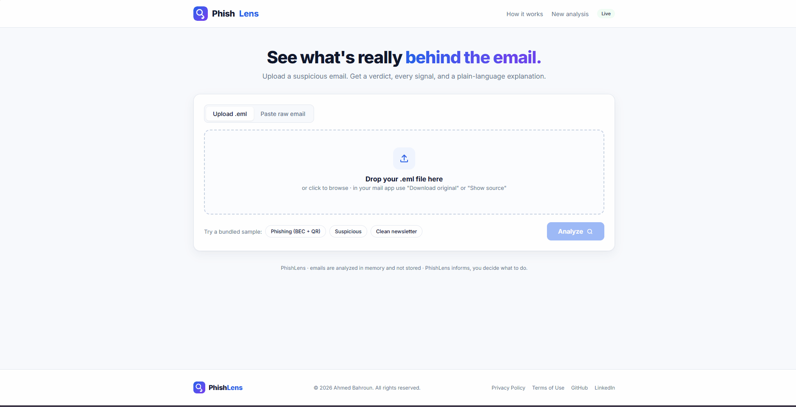
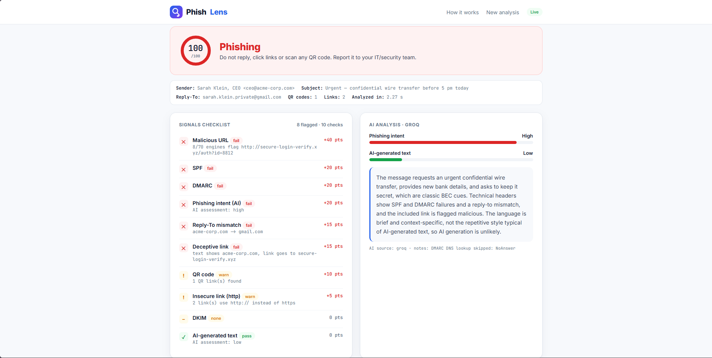
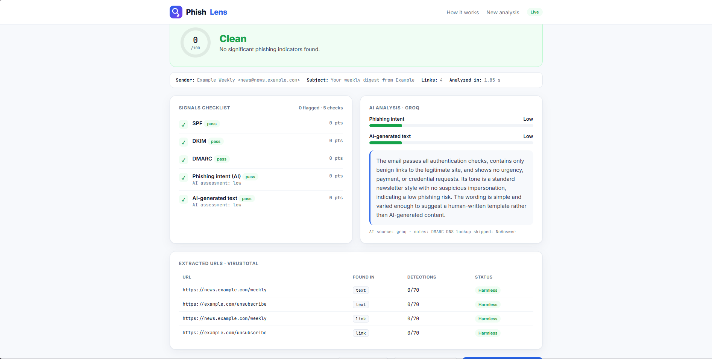
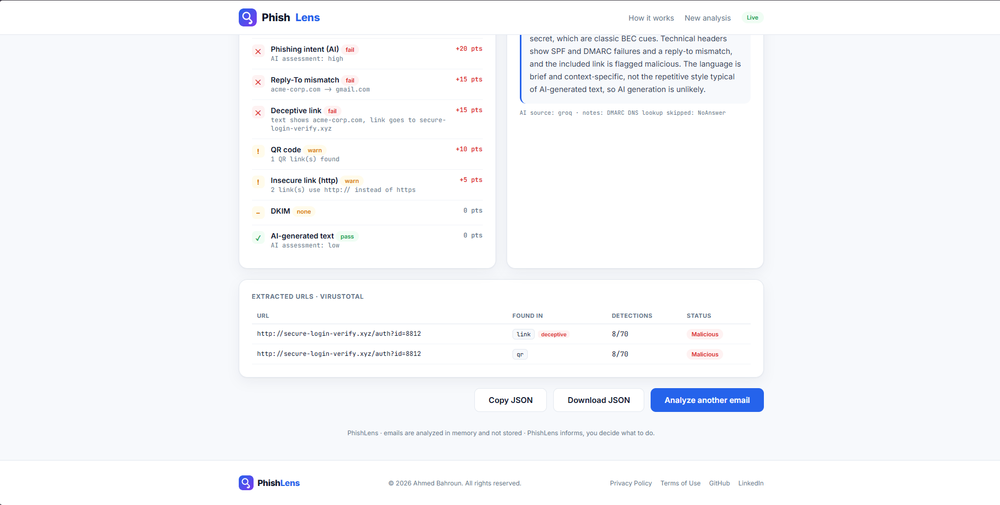

# PhishLens

**See what's really behind the email.**


PhishLens analyzes one suspicious email and tells you whether it's **Phishing**, **Suspicious**, or **Clean**, with every reason explained in plain language. Upload an `.eml` file (or paste the raw email) and get a scored, auditable report instead of a black-box guess.

**Live demo:** https://phishlens-va98.onrender.com 



## Why it's different

Most "AI phishing detectors" send the raw email to an LLM and ask for an opinion. PhishLens does the opposite order:

1. It checks the **technical evidence first**: sender authentication, links, QR codes, URL reputation.
2. Then an LLM (Groq) reasons over that **structured, verifiable evidence** and explains it.
3. A transparent scoring step adds up the signals. No single signal decides the verdict; several have to stack.

It's an on-demand forensic tool, like a malware sandbox for emails. It is not a mailbox monitor or a spam filter, and it never blocks anything. It informs, you decide.

## Screenshots

| Phishing | Clean |
|---|---|
|  |  |



## Features

- **Two inputs:** drag-and-drop an `.eml`, or paste the raw email
- **Explainable verdict:** colour-coded banner, 0-100 score, and a checklist of every signal with its exact point contribution
- **Sender authentication:** SPF, DKIM (re-verified with `dkimpy`), and DMARC (live DNS lookup)
- **Impersonation checks:** Reply-To mismatch, display-name spoofing, lookalike domains (typo and homoglyph aware, e.g. `paypa1` and `micros0ft`)
- **Link analysis:** deceptive links (visible text vs real `href`), lookalike link domains, insecure `http://` links
- **QR-code phishing (quishing):** decodes QR images in the email and checks the hidden URLs
- **URL reputation:** VirusTotal v3 (~70 engines), cached in SQLite and rate-limited for the free tier
- **AI analysis:** phishing-intent level, AI-generated-text estimate, and a plain-language explanation
- **Live pipeline view:** six stages animate while the analysis runs
- **CLI included:** same engine from the terminal, exit code encodes the verdict
- **Graceful degradation:** works with no API keys (technical signals still run, AI falls back to an offline estimate) and the report says which service was skipped
- **Export:** copy or download the JSON report

## How it works

One analyzer runs six steps in order. The web app and the CLI both call it, so no logic is duplicated.

```
   Browser ──POST /analyze──▶ main.py ──┐
                                        ├─▶ analyzer.analyze(raw_bytes)
   Terminal ───────────────▶ analyze.py ┘
                                        │
   1  parser.py     parse the .eml
   2  headers.py    SPF / DKIM / DMARC, reply-to, display spoof, lookalike
   3  extractor.py  URLs from text/HTML + QR decoding, deceptive/insecure flags
   4  virustotal.py URL reputation (SQLite cache, rate-limited)
   5  llm.py        Groq reasons over the evidence
   6  scoring.py    points -> score (0-100) -> verdict
```

### Scoring

| Total | Verdict |
|---|---|
| 60-100 | Phishing |
| 30-59 | Suspicious |
| 0-29 | Clean |

Heaviest signal is a VirusTotal malicious hit (+40). SPF fail and DMARC fail are +20 each, DKIM fail, Reply-To mismatch, deceptive link and lookalikes are +15. AI-generated text is deliberately the weakest signal (+5) and can never decide a verdict alone, because AI-text detection is unreliable.

The weights are hand-set starting points and meant to be tuned against a larger test set.

## Quick start

You need two free API keys:

| Key | Get it at | Used for |
|---|---|---|
| `GROQ_API_KEY` | https://console.groq.com/keys | AI reasoning |
| `VT_API_KEY` | https://www.virustotal.com/gui/my-apikey | URL reputation |

### Docker (recommended)

```bash
cp .env.example .env          # add your two keys
docker compose up --build     # open http://localhost:8001
```

The image bundles the native `zbar` library, so QR decoding works out of the box.

### Local Python

```bash
pip install -r requirements.txt    # needs native zbar: apt install libzbar0 / brew install zbar
cp .env.example .env
uvicorn app.web.main:app --reload  # open http://localhost:8000
```

On bare Windows Python, QR decoding is skipped because `zbar` isn't available. Use Docker for the full feature set.

### CLI

```bash
python analyze.py tests/samples/phishing_bec_qr.eml     # pretty report
python analyze.py some_email.eml --json                 # JSON only
cat some_email.eml | python analyze.py -                # from stdin
```

Exit code: `0` clean, `1` suspicious, `2` phishing.

## Configuration

Keys and settings live in `.env`. The app reads them at start-up, so after changing one, restart (`docker compose up -d --force-recreate`).

Optional overrides: `GROQ_MODEL`, `ALLOWED_ORIGINS`, `MAX_EMAIL_BYTES`, `VT_MIN_INTERVAL`, `CACHE_PATH`, `HTTP_TIMEOUT`.

## API

| Endpoint | Purpose |
|---|---|
| `GET /` | the single-page app |
| `GET /health` | `{status, services:{virustotal, groq}}` |
| `POST /analyze` | accepts an uploaded file or a `raw` form field, returns the JSON report |

<details>
<summary>Example report</summary>

```json
{
  "verdict": "phishing",
  "score": 95,
  "signals": [
    {"name": "SPF", "status": "fail", "detail": "", "points": 20},
    {"name": "Lookalike link", "status": "fail", "detail": "quota.mlcrosoftonline.com ~ microsoftonline (edit distance 1)", "points": 15}
  ],
  "urls": [
    {"url": "http://...", "source": "qr", "malicious": 7, "suspicious": 2, "status": "malicious", "deceptive": false}
  ],
  "llm": {
    "bec_likelihood": "high",
    "ai_generated_likelihood": "medium",
    "explanation": "The sender claims to be the CEO, but replies go to a Gmail address...",
    "source": "groq"
  },
  "meta": {
    "from": "...", "subject": "...", "reply_to": "...",
    "qr_codes_found": 1, "urls_found": 2, "elapsed_seconds": 1.9,
    "services": {"virustotal": true, "groq": true}
  }
}
```

</details>

## Evaluation

```bash
python eval/evaluate.py     # precision / recall / confusion matrix over eval/labels.csv
```

Three synthetic samples ship in `tests/samples/` (all domains and links are fictitious, regenerate them with `tests/make_samples.py`):

| File | Expected | Result |
|---|---|---|
| `phishing_bec_qr.eml` | phishing | 95 |
| `suspicious_lookalike.eml` | suspicious | 55 |
| `clean_newsletter.eml` | clean | 0 |

This confirms the pipeline works end to end. It does not prove the detector generalizes, since the set is tiny and self-generated. Growing the set with real phishing and clean emails is the next step.

## Deployment

The live demo runs from the same Dockerfile on Render's free tier. The VirusTotal cache is not persisted there, so it resets on restart, which only means a few extra lookups.

## Security and privacy

- Emails are analyzed **in memory and never stored**
- Only **URLs** are sent to VirusTotal; only **signals and body text** are sent to Groq
- Secrets never ship: `.env` is git-ignored and docker-ignored, and keys are injected at run time
- Hardened container: non-root user, read-only root filesystem, `no-new-privileges`, healthcheck
- Upload size cap (`MAX_EMAIL_BYTES`, default 10 MB), generic client-facing errors, CORS closed by default

## Limitations

- A brand-new phishing URL may be unknown to VirusTotal, which is why the other signals matter
- Forwarding can break DKIM on legitimate mail
- AI-text detection is unreliable, hence the low weight
- Pasting body text without headers leaves SPF/DKIM/DMARC as `unknown` (0 points). For full accuracy, use the real `.eml` ("Show original" / "View source")
- Scoring weights are hand-tuned, not learned

## Tech stack

Python 3.11+, FastAPI + Uvicorn, vanilla HTML/CSS/JS (no build step), `dkimpy`, `dnspython`, `pyzbar` + `Pillow`, VirusTotal API v3, Groq (`openai/gpt-oss-120b`), SQLite, Docker.

## Project structure

```
phishlens/
├── app/
│   ├── config.py
│   ├── core/          # the analysis brain (pure Python, no web code)
│   └── web/           # FastAPI routes, template, static files
├── analyze.py         # CLI
├── tests/             # sample emails + generator
├── eval/              # evaluate.py + labels.csv
├── docs/              # screenshots and demo GIF
├── package.py         # builds a secret-free share zip
├── Dockerfile
└── docker-compose.yml
```

## License

MIT. See [LICENSE](LICENSE).
